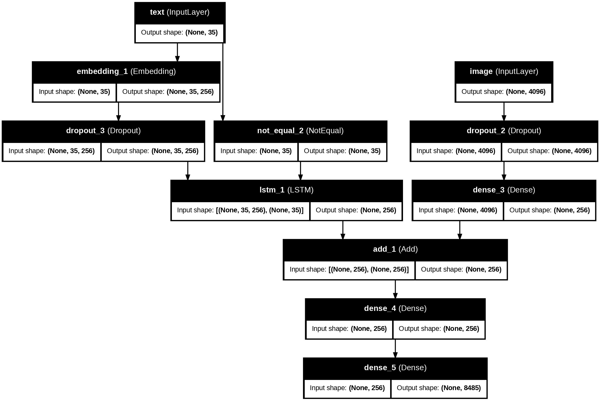
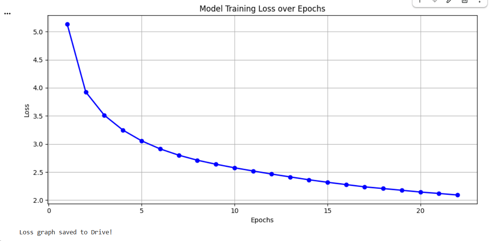

#  Image Caption Generator — CNN + LSTM

> An end-to-end deep learning system that automatically generates natural language captions for images using **VGG16 (CNN) + LSTM** architecture, trained on the **Flickr8K Dataset**.

---

##  Project Overview

This project builds an **Image Caption Generator** that:
- Extracts image features using **pre-trained VGG16** (Transfer Learning)
- Generates captions word-by-word using an **LSTM decoder**
- Evaluates performance using **BLEU** and **METEOR** scores
- Deploys as an interactive **Streamlit Web Application**

---

##  Model Performance

| Metric | Score | Status |
|--------|-------|--------|
| **BLEU-1** | **0.5514** | ✅ Excellent (Baseline: 0.40) |
| **BLEU-2** | **0.3230** | ✅ Good |
| **METEOR** | **0.3806** | ✅ Good |

> BLEU-1 score of **0.5514** surpasses the reference baseline of **0.516** 🏆

---

##  Architecture

```
Input Image
     │
     ▼
┌─────────────┐        ┌──────────────┐
│   VGG16     │        │  Embedding   │
│ (Pretrained)│        │  + LSTM      │
│  → 4096 dim │        │  (256 units) │
└──────┬──────┘        └──────┬───────┘
       │                      │
       └──────────┬───────────┘
                  ▼
           ┌────────────┐
           │  Add Layer │
           │  (Merge)   │
           └─────┬──────┘
                 ▼
          ┌────────────┐
          │   Dense    │
          │ (Softmax)  │
          └─────┬──────┘
                ▼
         Generated Caption
```

---

## Model Architecture Diagram



---

## Training Loss Graph



> Loss decreased from **5.13 → 2.09** over **21 epochs** — smooth convergence!

---

##  Streamlit Application

### Dashboard — Model Info + Loss Graph


### Caption Generation — Live Demo


>  Uploaded a dog image → Model generated: **"dog is playing in the water"**

---

##  Sample Predictions

### Prediction 1 — Dog in Water


)

| Type | Caption |
|------|---------|
| Actual | "black dog running in the surf" |
| Actual | "black lab with tags frolics in the water" |
| **Predicted** | **"black dog with tags frolicks in the water"** ✅ |

---

### Prediction 2 — People on Beach


| Type | Caption |
|------|---------|
| Actual | "two people running on beach" |
| Actual | "two people run down the beach" |
| **Predicted** | **"young girl in shorts are running on the beach"** ✅ |

---

## Project Structure

```
image-caption-generator/
├── app.py                      # Streamlit web application
├── snmatrix_assignment.ipynb   # Full training notebook (Google Colab)
├── tokenizer.pkl               # Saved Keras tokenizer
├── loss.png                    # Training loss graph
├── model_architecture.png      # Model architecture diagram
└── README.md                   # Project documentation
```

---

## How to Run

### Step 1 — Clone Repository
```bash
git clone https://github.com/krinkughosh3112-wq/image-caption-generator.git
cd image-caption-generator
```

### Step 2 — Install Dependencies
```bash
pip install streamlit tensorflow pillow numpy plotly nltk
```

### Step 3 — Add Model Weights
Download `model_epoch_21.h5` and place in the project folder.

### Step 4 — Run Application
```bash
streamlit run app.py
```

### Step 5 — Open Browser
```
http://localhost:8501
```

---

##  Tech Stack

| Component | Technology |
|-----------|------------|
| **CNN (Feature Extraction)** | VGG16 (pretrained, ImageNet) |
| **Language Model** | LSTM (256 units) |
| **Framework** | TensorFlow / Keras |
| **Dataset** | Flickr8K (8,091 images) |
| **Web App** | Streamlit |
| **Evaluation** | NLTK (BLEU + METEOR) |
| **Visualization** | Plotly, Matplotlib |
| **Environment** | Google Colab (T4 GPU) |

---

##  Model Hyperparameters

| Parameter | Value |
|-----------|-------|
| Epochs | 21 |
| Batch Size | 32 |
| Optimizer | Adam |
| Loss Function | Categorical Crossentropy |
| Embedding Dimensions | 256 |
| LSTM Units | 256 |
| Dropout Rate | 0.4 |
| Vocabulary Size | 8,485 |
| Max Caption Length | 35 |
| Train Split | 90% (7,281 images) |
| Test Split | 10% (810 images) |

---

## Requirements

```
tensorflow>=2.0
streamlit
pillow
numpy
plotly
nltk
```

---

##  Future Improvements

- [ ] Replace VGG16 with **InceptionV3** or **EfficientNetB7** for better features
- [ ] Add **Attention Mechanism** for more accurate captions
- [ ] Train on **MS-COCO** dataset (120K+ images)
- [ ] Implement **Beam Search** decoding
- [ ] Deploy on **Streamlit Cloud** or **Hugging Face Spaces**

---

##  Author

**Rinku Ghosh**
Data Science & AI/ML Professional

[](https://linkedin.com/in/k-rinku-ghosh3112/)
[](https://github.com/krinkughosh3112-wq)

---

## References

- Flickr8K Dataset — [Kaggle](https://www.kaggle.com/datasets/adityajn105/flickr8k)
- TensorFlow Documentation — [tensorflow.org](https://www.tensorflow.org)

---

<p align="center">Built with  using VGG16 + LSTM | Flickr8K Dataset</p>

